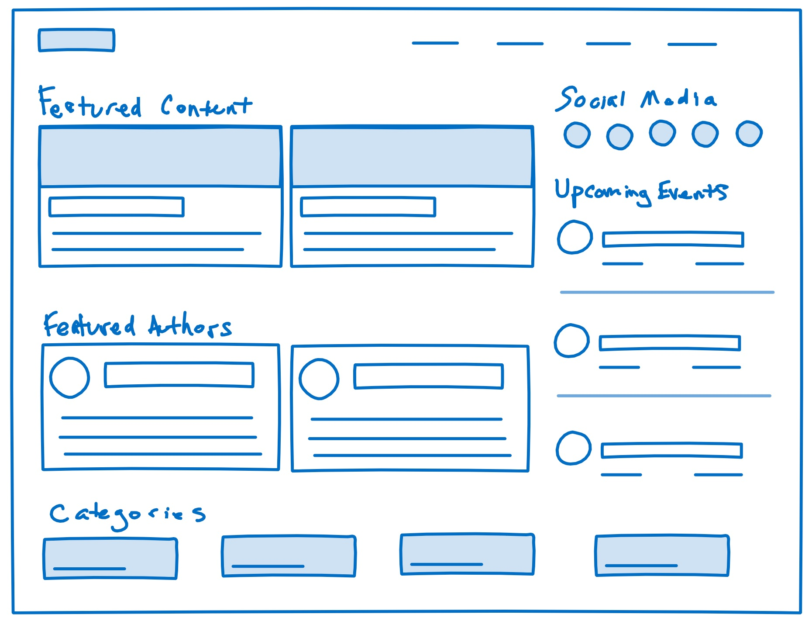

## Background
This template is taken from Basecamp's [Shapeup](https://basecamp.com/shapeup) book on how they do work. It's a framework for scoping out and "shaping" a project.

## Template

### Problem
The raw idea, a use case, or something we’ve seen that motivates us to work on this
 
 
### Appetite
How much time we want to spend and how that constrains the solution
 
 
### Solution
The core elements we came up with, presented in a form that’s easy for people to immediately understand
 
 
### Rabbit Holes
Details about the solution worth calling out to avoid problems
 
 
### No-Gos
Anything specifically excluded from the concept: functionality or use cases we intentionally aren’t covering to fit the appetite or make the problem tractable

## Example

### Problem
*The raw idea, a use case, or something we’ve seen that motivates us to work on this*
 
The current SBA.gov site is very focused on evergreen content relating to the knowledge and processes needed to start or expand a small business. Although the site includes more timely interactive content like a blog and event finder, it's not very prominent and misses an opportunity to inform the community about "what's happening now." Also, it's not very visually inspiring or engaging.
 
### Appetite
*How much time we want to spend and how that constrains the solution*
 
Acknowledging that this is a side project and is lower in priority to client projects, we'll give ourselves a constraint of 6 weeks and see what we can produce within that timeframe.
 
### Solution
*The core elements we came up with, presented in a form that’s easy for people to immediately understand*
 
A "mini site" (landing page) that focuses on timely, interactive, user-generated content and community, including blogs, events, and social media. The goal is foster a more vibrant small business community, both online and offline, so entrepreneurs can begin to see SBA as a hub of networking and new information as opposed to just a reference resource for process and legal information.
 
#### Scope
This could change over the course of the 6-week cycle depending on how much time we have and what issues we run into. But it could include things like this:
- Recent and featured blogs
- Upcoming events
- Social media posts and/or links
- Other groupings like blog categories or authors
- Calls to action to contribute

#### Rough Concept
This is just to convey the basic concept. It's not a wireframe that has to be adhered to for content or layout. Merely a conversation starter...

 
### Rabbit Holes
*Details about the solution worth calling out to avoid problems*
 
- We have a lot of text content available through the SBA API, but not a lot of visual content. This is both good and bad. Leaves open opportunities, but means we'll have to generate more on the visual design side.
- As part of this side project, we may want to actually publish the site. Although we won't promote it externally, not sure if there are potential implications for reusing this content, even for "educational" purposes.
- As much as possible, we should all work in the same Webflow project. But apparently, we cannot be in Designer at the same time.
- While we may be inspired by the current SBA branding, I don't think we have to limit ourselves to that. The main thing is that we should base it on USWDS 2.x.
 
### No-Gos
*Anything specifically excluded from the concept: functionality or use cases we intentionally aren’t covering to fit the appetite or make the problem tractable*
 
- We won't be doing anything that requires authentication.
- To keep the info architecture simple, I don't think we should worry about this fits into the larger SBA site. It can be standalone (though it may link back to sba.gov).
- I assume we'll get some kind of search out of the box, but if it's too complicated, we can drop it. The emphasis should be on building a great looking site with managed content quickly. 😁